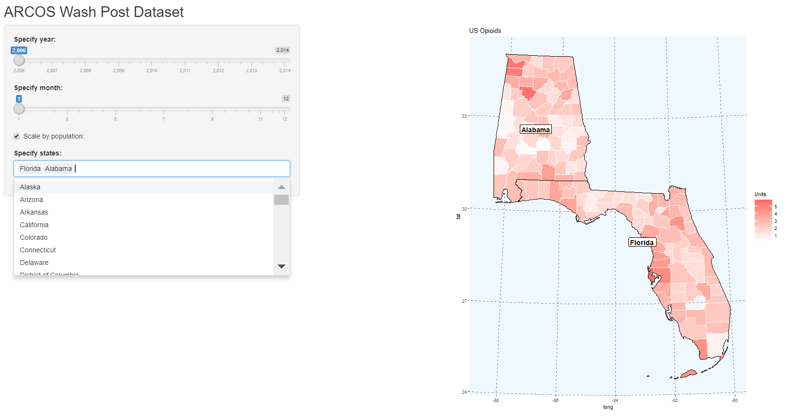

ARCOS WashPost - US Opioids
================
Lars VC
11-1-2021

In this R Markdown document (made using Shiny), we showcase the
evolution of opioid transactions by US county, over time, retrieved from
the ARCOS dataset. The Washington Post gained access to the Drug
Enforcement Administration’s Automation of Reports and Consolidated
Orders System, known as ARCOS, as the result of a court order. The Post
and HD Media, which publishes the Charleston Gazette-Mail in West
Virginia, waged a year-long legal battle for access to the database,
which the government and the drug industry had sought to keep secret.

Here are the links to the articles on the [lobbying efforts targeted
towards the
DEA](https://www.washingtonpost.com/graphics/2017/investigations/dea-drug-industry-congress/?tid=graphics-story),
the [legal battle to obtain access to the
data](https://www.washingtonpost.com/health/how-an-epic-legal-battle-brought-a-secret-drug-database-to-light/2019/08/02/3bc594ce-b3d4-11e9-951e-de024209545d_story.html)
and the [follow-up
reporting](https://www.washingtonpost.com/national/2019/08/12/post-released-deas-data-pain-pills-heres-what-local-journalists-are-using-it/)
on the ARCOS dataset.

The data are available in [unfiltered
format](https://wpinvestigative.github.io/arcos/#download-the-raw-data),
as well as via a public [RESTful
API](https://wpinvestigative.github.io/arcos/).

# the Shiny application

## Looks as follows:

 \# Enter in your R console:

``` r
runGitHub( "ARCOS", "larsvancutsem")
```
